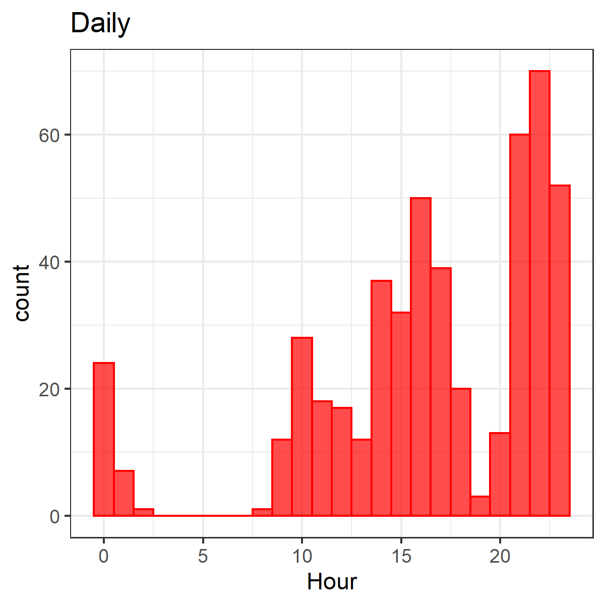
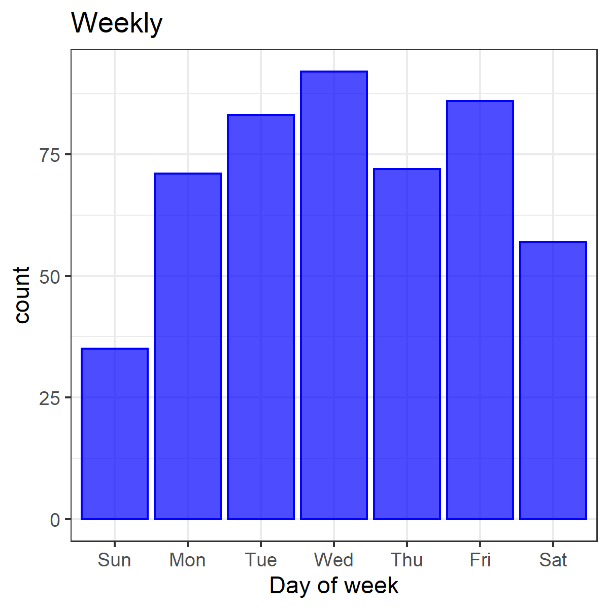
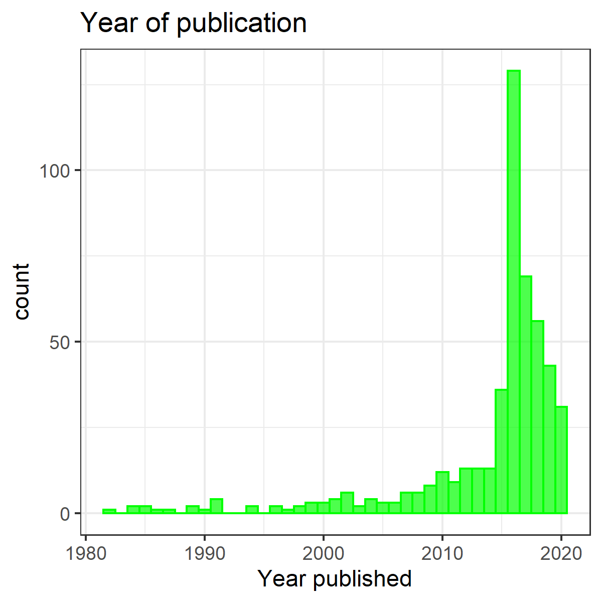

## Tracking my progress on #365papers

Some simple *R* code to log my progress on [#365papers](https://dynamicecology.wordpress.com/2016/01/04/a-recap-of-my-year-in-365papers/):

1. Read in data from a google spreadsheet using *gsheets.* The spreadsheet contains entries automagically logged each time I tweet using the hashtag #365papers (automatic updating of the spreadsheet is implemented using IFTTT). See [blog post](https://scrogster.wordpress.com/2016/01/07/tracking-365-papers-with-ifttt/) for details.

2. Data are tidied using *tidyr*, and publication dates extracted using *stringr*.

3. Some basic graphs are plotted to show progress towards target; daily and weekly patterns; and years of publication of papers. Graphs are plotted using *ggplot*.

