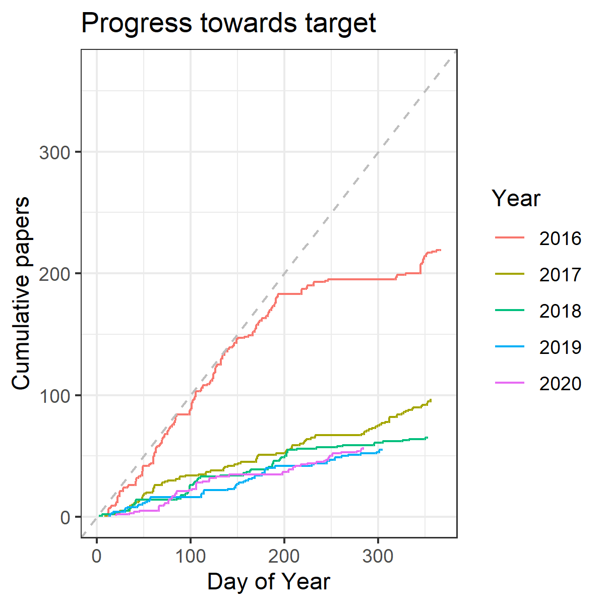

## Tracking my progress on #365papers

R code to log my progress on #365papers:

1. Reads in data from a google spreadsheet, which automagically logs new #365papers entries each time I tweet (using IFTTT). See https://scrogster.wordpress.com/2016/01/07/tracking-365-papers-with-ifttt/ for details

2. Data tidied using *tidyr*

3. Some basic graphs plotted to show progress towards target, and diurnal and weekly patterns to tweets.

 | 
 | 